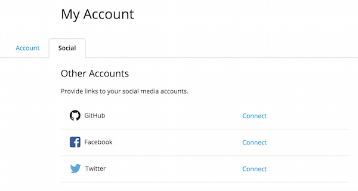
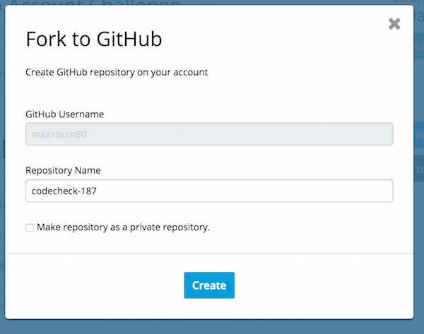

# Hello World

Welcome to codecheck!
Let's learn how to use codecheck by taking this tutorial.

### 1-1.  Watch out for the "Deadline" and "Time Limit"!
After opening a challenge, you will see the detail page of the challenge.
On the detail page you will see the deadline and time limit.
Keep in mind that you cannot submit your answer after the time expires!

### 1-2. Choose your weapon (Web Editor or GitHub)
You can choose to solve the challenge in either our dedicated Web Editor or in your local environment via our Fork to Github feature.

## 2. Solving in the Web Editor
**First off, try clicking the "Open Web Editor" button located on the right side of the screen.**

### 2-1. Open Files
After the web editor finishes loading, click the below link in the web editor.  
[test1.js](test/test1.js)  
Make sure the file you clicked is open in the editor.
You can open specified files by clicking on their link or you can open a file from the project tree on the left menu of the editor.

Open ``` app/hello.js ``` from the project tree.  

[hello.js](app/hello.js)  
should show up in the editor.

### 2-2. Edit Files
Let's edit a file!  

Edit
```
//return "Hello World";
```
to
```
return "Hello World";
```
by removing the comments `//`. 

### 2-3. Save Files
You need to save the edited files in order to run the test code.
Click the "Save" button after you have made sure that ```app/hello.js``` has been checked.
Click "Continue" in the pop-up to continue editing in the editor.

### 2-4. Running a Project
You can run a unit test to verify that you have solved the challenge correctly.
Click the "RUN" button in the middle of the editor to start running the test.
You should see the result of the test displayed on the console.

For example:
```
codecheck: Finish 'npm install with code 0
1..2
ok 1 helloWorld Hello World!
# tests 2
# pass 1
# fail 1
codecheck: Finish with code 1
codecheck: tests  : 2
codecheck: success: 1
codecheck: failure: 1
```
This means that you have been able to solve 1 out of the 2 tests.

### 2-6. Solve the Challenge
Currently the challenge is not solved correctly. 
Rewrite the previous code for it to pass  
[test1.js](test/test1.js)  

If solved correctly, running the project should display the result as shown below:

```
codecheck: Finish 'npm install with code 0
1..2
ok 1 helloWorld Hello World!
# tests 2
# pass 2
# fail 0
codecheck: Finish with code 1
codecheck: tests  : 2
codecheck: success: 2
codecheck: failure: 0
```

Codecheck can support you in practicing to implement features, which satisfies the requirements while reading some test codes.

### 2-7. Confirm Saved Files
Click the "Save" button again after you finish editing any files.
Go back to the challenge detail page by clicking the "Back" button.

If your project is saved correctly "Saved [time]" will appeared on the "Open Web Editor" button.

## 3.Solve in GitHub (For GitHub users)
### 3-1. Authenticate with GitHub
To begin, you need to authenticate codecheck with your GitHub account before solving a challenge in GitHub.  
Proceed to [this page](https://app.code-check.io/settings/social) and click "Connect" to authenticate your GitHub account.
  

Reload the challenge page after it is completed.
Now you can select "Fork to GitHub".

### 3-2. Fork to GitHub
Click the "Fork to GitHub" button.  
  
Enter the name of the repository and click "Create".
You can jump to the repository by clicking the link that appears on the dialog.

### 3-4. Edit answer.md
Clone the repository to your localhost by using Git to edit your solution using your preferred editor/environment.

Let's edit [answer.md] .
Show your originality and ingenuity by explaining your solution on [answer.md](answer.md)  
Try to answer the questions written in the comment in answer.md.

### 3-5. Save your answer
Save your repository to codecheck by pushing it to remote master.

Go back to the challenge detail page and check "Saved [time]".
It should be updated with the submitted time.

### 3-6. Confirm in Web Editor
Once you have saved your answer, open the Web Editor to check if it has been properly saved.
Open [answer.md](answer.md) from the Web Editor.
Confirm that the answer is updated by checking to see if the "Save" button becomes disabled.
**Keep in mind that once you start editing in GitHub, you can't edit and save the file from the Web Editor.**

Click the "RUN" button.
If the result is the same as below, this means you solved the challenge correctly.

```
codecheck: Finish 'npm install with code 0
1..2
ok 1 helloWorld Hello World!
# tests 2
# pass 2
# fail 0
codecheck: Finish with code 0
codecheck: tests  : 2
codecheck: success: 2
codecheck: failure: 0
```
This way, you can check your answer by running test codes in the web editor, even if you are solving it with GitHub.


## 4. Submit Challenge
### 4-1. Submit challenge
Go back to the challenge detail page and click the "Submit" button.  
Keep in mind that you can no longer edit the files once you have submitted the challenge.


### 4-2. Display answer.md and Comment
Make sure answer.md is displayed on the page.  
You can express your developer skills with
- the project that you submit and
- answer.md that you edit 
in codecheck.

Post comments to interact with other users!

### 4-3. LGTM！
"LGTM" stands for `Looks Good To Me`.  
Browse other people's answers by searching the participants list (click "Back to Participants").
Add LGTMs for answers you like!

(※ We are considering new LGTM features.)
