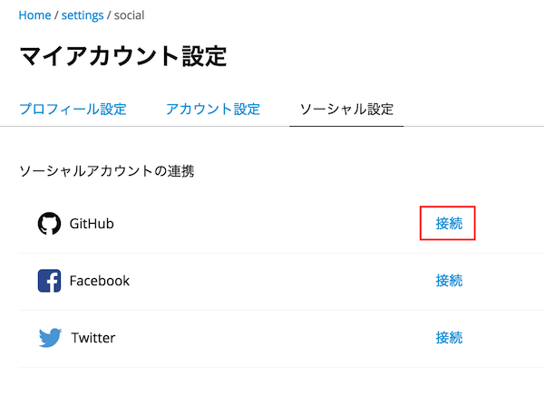
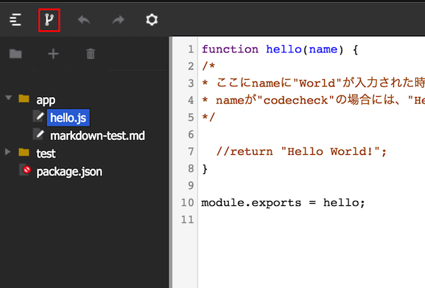
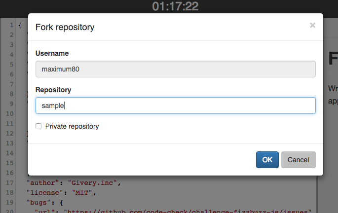
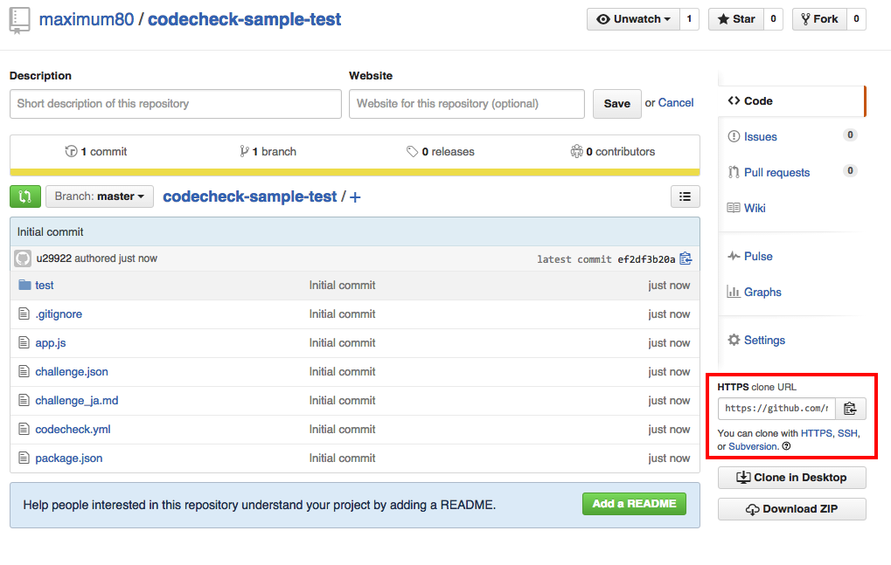

# Hello World
## 1.codecheckで「Hello world」を試してみよう

現在、皆様は試験を開始して、チャレンジを開いています。
早速ですが、試しにcodecheckを利用して、問題を回答してみましょう。

### 1-1. ファイルの移動
こちらのリンクをクリックしてください。  
[test1.js](test/test1.js)  
リンクで指定されたファイルが、エディタ上で開かれていることを確認してください。
リンクをクリックして指定されたファイルを表示することが可能です。
また、もとの編集ファイルに戻るには、画面左側のプロジェクトツリーから
```
app/hello.js
```
を再度クリックしてください。  

[hello.js](app/hello.js)  
のファイルが開かれます。

### 1-2. ファイルの編集
エディタ上のファイルを編集してみましょう。  
```
//ここにHelloworldを実装します。
```
と書かれている下の行のコメントアウトを外して
```
//return "Hello World";
```
から
```
return "Hello World";
```
にしてみましょう。

### 1-3. ファイルの保存
編集したファイルの実行にはまず編集したファイルの保存が必要です。
編集が完了したら、画面右上の"SAVE"ボタンをクリックしましょう。  
"app/hello.js"にチェックが入っていることを確認して、ファイルを保存してください。  
保存が完了したら"continue"ボタンを選択しましょう。

### 1-4. ファイルの実行
正しく実行できているかどうかを確かめるために、テスト（正しく動いているかどうかを確かめるコード）を実行することが出来ます。
エディタ中部の”RUN”ボタンをクリックしてみましょう。  
クリックすると、テストコードが実行されます。少々時間がかかりますが、最後に

```
codecheck: Finish 'npm install with code 0
1..2
ok 1 helloWorld Hello World!
# tests 2
# pass 1
# fail 1
codecheck: Finish with code 0
codecheck: tests  : 2
codecheck: success: 1
codecheck: failure: 1
```
と表示されれば問題なく実行されています。  
この場合、テストケース（期待される入力と出力値）2つに対して、1つが正しく回答ができている事になります。

### 1-5. ファイルの保存
編集が完了したら、改めて画面右上の"SAVE"ボタンをクリックしましょう。  
クリック後に表示されているファイルの中から「保存したいファイル」を選択してください。
ファイルが保存をされたら、"Back"ボタンをクリックして、チャレンジの一覧ページに戻ってください。

## 2.GitHubを使って回答してみよう
### 2-1.GitHubアカウントの連携
まず、GitHubを活用して回答をする場合、codecheck内でGitHubアカウントの連携が必要です。  
[こちらのページ](https://app.code-check.io/settings/social)から、GitHubアカウントの連携をおこないます。
  
こちらの「接続」をクリックし、GitHubのアカウントの連携をしてください。

### 2-2.チャレンジをフォークしてみましょう
WebエディタからGitHubにチャレンジをフォークしてみましょう。  
  
画面左上のフォークボタンをクリックしてください。すると、モーダルが立ち上がります。
  
リポジトリ名を入力して、OKを選択してみましょう。  
すると、GitHubの生成されたリポジトリURLが表示されます。  
表示されたURLをクリックすると、生成されたGitHubのページにジャンプすることが出来ます。

### 2-3.ローカルへのクローン
   
生成されたリポジトリをローカルにクローンします。  
これは通常のGitHubのクローンと同様です。  
SSH、またはHTTPSのクローンURL(@GIT_URL)をコピーしてください。  
コマンドラインから、
```
$ git clone {@GIT_URL}
```
で、ローカルにリポジトリを落とすことが出来ます。
これであとはお好きな環境、エディタで編集をしていただくことが出来ます。

### 2-4. 回答の編集
現段階では、完璧な回答ではありません。
ローカルに落としたリポジトリ内のhello.jsをお好きなエディタで開いてください。  
先ほどChallengeVeiwer上でコメントアウトを外した行を
```
return "Hello "+name+"!";
```
に書き換えて、保存しましょう。

### 2-5. 回答の保存
回答を編集したら、コミットをしてリモートのmasterにプッシュします。
無事にリモートのmasterにプッシュが完了すると、codecheck側にもmasterの編集内容が保存されます。
```
$ git push origin master
```
を実行した後に、試験の詳細画面に戻ってください。  
「保存」の下に表示されている時間が、pushをした時間に切り替わったか確認をしてください。  

### 2-6. 保存されているかの確認
保存が完了したら、正しく保存ができているのか、改めてChallenge Viewerで確かめてみましょう。  
今開いているこのブラウザタブをリロードしてみてください。  
編集したファイルが正しく保存され、更新されていれば完了です。  
また、画面右上のSAVEボタンが押せなくなっています。  
**一度GitHubで受験をし、ローカルから保存をすると、Challenge Viewerからは保存ができなくなるので、ご注意下さい**

最後に、Runボタンを押してみましょう。

```
codecheck: Finish 'npm install with code 0
1..2
ok 1 helloWorld Hello World!
# tests 2
# pass 2
# fail 0
codecheck: Finish with code 0
codecheck: tests  : 2
codecheck: success: 2
codecheck: failure: 0
```
が表示されたら成功です。  
このように、GitHub上で受験、保存をした後も、ChallegeViewer上でテストの結果を確かめることは可能です。
