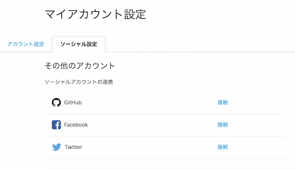
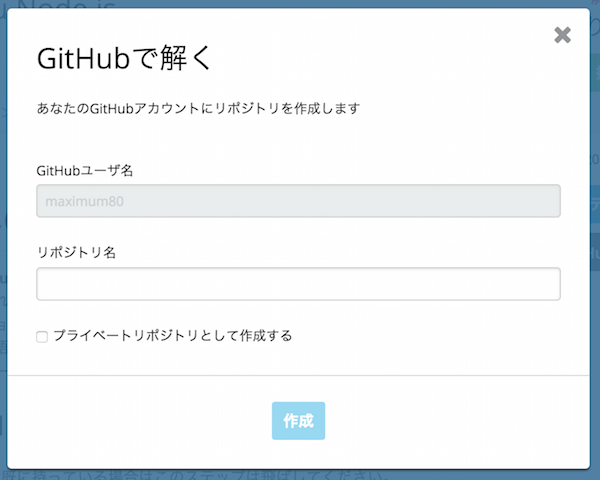

# Hello World
## 1.codecheckで「Hello world」を試してみよう
現在、公開されているチャレンジを開いています。
早速ですが、試しにcodecheckを利用して、問題を回答してみましょう。

### 1-1.  制限時間・締切を確認しよう
チャレンジを開始すると、このようにチャレンジの詳細を閲覧することが出来ます。  
また、画面上部には、制限時間・或いは解答締切が表示されています。  
制限時間や締切をオーバーすると解答の提出ができませんので、ご注意ください。  

### 1-2. Webエディタ or GitHubでの解答の選択
codecheckでは専用のWebエディタで問題を回答するか、GitHubアカウントを活用して、自身のローカル環境にて問題の回答をすることが出来ます。まずは、画面右側にある"Webエディタで開く"ボタンをクリックして、Webエディタを立ち上げてみましょう。

## 2. Webエディタで解答してみよう
### 2-1. ファイルの移動
こちらのリンクをクリックしてください。  
[test1.js](test/test1.js)  
リンクで指定されたファイルが、エディタ上で開かれていることを確認してください。
リンクをクリックして指定されたファイルを表示することが可能です。
また、もとの編集ファイルに戻るには、画面左側のプロジェクトツリーから
```
app/hello.js
```
を再度クリックしてください。  

[hello.js](app/hello.js)  
のファイルが開かれます。

### 2-2. ファイルの編集
エディタ上のファイルを編集してみましょう。  
```
//ここにHelloworldを実装します。
```
と書かれている下の行のコメントアウトを外して
```
//return "Hello World";
```
から
```
return "Hello World";
```
にしてみましょう。

### 2-3. ファイルの保存
編集したファイルの実行にはまず編集したファイルの保存が必要です。
編集が完了したら、画面右上の"SAVE"ボタンをクリックしましょう。  
"app/hello.js"にチェックが入っていることを確認して、ファイルを保存してください。  
保存が完了したら"continue"ボタンを選択しましょう。

### 2-4. ファイルの実行
正しく実行できているかどうかを確かめるために、テスト（正しく動いているかどうかを確かめるコード）を実行することが出来ます。
エディタ中部の”RUN”ボタンをクリックしてみましょう。  
クリックすると、テストコードが実行されます。少々時間がかかりますが、最後に

```
codecheck: Finish 'npm install with code 0
1..2
ok 1 helloWorld Hello World!
# tests 2
# pass 1
# fail 1
codecheck: Finish with code 1
codecheck: tests  : 2
codecheck: success: 1
codecheck: failure: 1
```
と表示されれば問題なく実行されています。  
この場合、テストケース（期待される入力と出力値）2つに対して、1つが正しく回答ができている事になります。

### 2-6. 正しい解答をしてみよう
現段階では、完璧な回答ではありません。
先ほどWebエディタ上でコメントアウトを外した行を書き換えて、
[test1.js](test/test1.js)  
の2つのテストを通過するコードを書いてみましょう。もし、正しく解答ができた場合は、

```
codecheck: Finish 'npm install with code 0
1..2
ok 1 helloWorld Hello World!
# tests 2
# pass 2
# fail 0
codecheck: Finish with code 1
codecheck: tests  : 2
codecheck: success: 2
codecheck: failure: 0
```
と表示がされます。このように、codecheckでは、テストコードを読みながら、正しく仕様を満たす実装を書くプラクティスをおこなうことが可能です。

### 2-5. 保存されているかの確認
編集が完了したら、改めて画面右上の"SAVE"ボタンをクリックしましょう。(編集されたファイルがない場合は、"No edited files."が表示されます)  
表示されているダイアログから、"Back"ボタンをクリックして、チャレンジの詳細画面に戻ってください。  
"Webエディタで開く"ボタンの上に、"保存 on [保存された時間]"が表示されていれば正しく保存ができていることになります。

## 3.GitHubを使って解答してみよう
### 3-1.GitHubアカウントの連携
まず、GitHubを活用して回答をする場合、codecheck内でGitHubアカウントの連携が必要です。  
[こちらのページ](https://app.code-check.io/settings/social)から、GitHubアカウントの連携をおこないます。
  
こちらの「接続」をクリックし、GitHubのアカウントの連携をしてください。
アカウントの連携が完了しましたら、再度こちらの画面をリロードしてください。  
正しく接続が完了すると、"GitHubで解く"ボタンが選択できるようになります。

### 3-2.チャレンジをフォークしてみましょう
画面右側の"GitHubで解く"をクリックしてみましょう。
  
上記のダイアログが立ち上がったら、リポジトリ名を入力して、作成を選択してみましょう。  
すると、GitHubの生成されたリポジトリURLが表示されます。  
表示されたURLをクリックすると、生成されたGitHubのページにジャンプすることが出来ます。

### 3-3.ローカルへのクローン
   
生成されたリポジトリをローカルにクローンします。  
これは通常のGitHubのクローンと同様です。  
SSH、またはHTTPSのクローンURL(@GIT_URL)をコピーしてください。  
コマンドラインから、
```
$ git clone {@GIT_URL}
```
で、ローカルにリポジトリを落とすことが出来ます。
これであとはお好きな環境、エディタで編集をしていただくことが出来ます。

### 3-4. answer.mdの編集
codecheckでは、あなたが工夫して解答した点を[answer.md](answer.md)にまとめることが出来ます。
こちらのファイルを開いて、以下の部分を自由に記入してみましょう。  
また、こちらにSandBoxとして、markdown形式で好きなように内容を編集してみてください。  
ただし、提出されたらanswer.mdは外部に公開されますので、ご注意ください。  

### 3-5. 回答の保存
回答を編集したら、コミットをしてリモートのmasterにプッシュします。
無事にリモートのmasterにプッシュが完了すると、codecheck側にもmasterの編集内容が保存されます。
```
$ git push origin master
```
を実行した後に、チャレンジの詳細画面に戻ってください。  
「保存」の下に表示されている時間が、pushをした時間に切り替わったか確認をしてください。  

### 3-6. 保存されているかの確認
保存が完了したら、正しく保存ができているのか、改めてWebエディタで確かめてみましょう。  
Webエディタ画面を再度開いてみてください。(既に開いている場合はリロード)  
編集したファイルが正しく保存され、更新されていれば完了です。  
また、画面右上のSAVEボタンが押せなくなっています。  
**一度GitHubで受験をし、ローカルから保存をすると、Webエディタからは編集・保存ができなくなるので、ご注意下さい**

また、Webエディタ上で[answer.md](answer.md)を開いてみましょう。
あなたがローカルで編集した内容が反映されたら成功です。  

最後に、RUNボタンを押してみましょう。
```
codecheck: Finish 'npm install with code 0
1..2
ok 1 helloWorld Hello World!
# tests 2
# pass 2
# fail 0
codecheck: Finish with code 0
codecheck: tests  : 2
codecheck: success: 2
codecheck: failure: 0
```
が表示されたら正しく解答ができていることになります。  
このように、GitHub上で受験、保存をした後も、Webエディタ上でテストの結果を確かめることは可能です。

## 4. チャレンジを提出しよう
全ての解答内容の保存が確認できたら、解答を提出しましょう。
チャレンジの詳細画面に戻り、画面右上の「提出（submit）」ボタンを押して「OK」をクリックすると、提出が完了します。  
一度提出をすると、変更や再受験は出来ませんので、ご注意ください。  
コメント(Comment)タブを開くと、あなたが記入したasnwer.mdが表示されています。
このように、codecheck上では、
- 提出したプロジェクト(リポジトリ、ソースコード)
- 記入したanswer.md
を活用して自身のエンジニアスキルを表現することが可能です。
