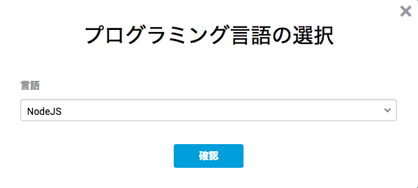

# Hello World
## 1.codecheckで「Hello world」を試してみよう

現在、皆様は試験を開始して、チャレンジを開いています。
早速ですが、試しにcodecheckを利用して、問題を回答してみましょう。

今受けている問題は複数言語対応問題です。
皆様には引数から入力を取り、標準出力に結果を出力する、コマンドラインツールを実装していただきます。

#### 1-0. 初回の言語選択
このチャレンジを始める時に次のような画面が表示されたと思います。


ドロップダウンをクリックすると選択できる言語が表示されるので、自分が使いたい言語を選択して、`確定`ボタンをクリックしてください。

ファイル構成は言語によって変わりますが、原則として以下のルールに沿ってファイルが生成されます。
- コンパイル言語は src ディレクトリに main ファイルがある
- スクリプト言語は app ディレクトリに main ファイルがある

まずは Web Editor の使い方の説明があり、その後に使う言語を変更したい場合の手順を記載しています。
（Web Editor で解答中に言語を変更する際は、途中まで書いていた **コードは全て破棄されます** 。注意してください。）

#### 1-1. ファイルの移動
ファイルの移動は画面左側のプロジェクトツリーから選択する事が可能です。  
選択されているファイルは青くハイライトされます。今開いている main ファイルが青くハイライトされている事を確認してください。

また、こちらに記載されているリンクからもファイルを開く事が可能です。  
test1.js への[リンク](test/test1.js) をクリックしてください。  
test1.js がエディタ上で開かれ、プロジェクトツリーのハイライトも変わっていることを確認してください。

確認ができたら、先程ハイライトされていた main ファイルへ、プロジェクトツリーのフォルダをクリックして移動しましょう。

#### 1-2. ファイルの編集
次にエディタ上のファイルを編集してみましょう。  

このプログラムは引数に名前を受け取り、"Hello xxx!" のフォーマットで出力します。
また、main関数に渡される引数は **プログラム自身を含まない** 引数になっています。

ここでは nodejs を例に解答を示します。

```js
"use strict";
function main(argv) {
  let name = '';
  if (argv.length > 0) {
    name = argv[0]
  }
  console.log(`Hello ${name}!`);
}
module.exports = main;
```

解答に沿ったプログラムを実装してみましょう。

#### 1-3. ファイルの保存
編集したファイルの実行にはまず編集したファイルの保存が必要です。
編集が完了したら、画面右上の `SAVE` ボタンをクリックしましょう。  


編集した main ファイルにチェックが入っていることを確認して、ファイルを保存してください。  
保存が完了したら `continue` ボタンを選択しましょう。

#### 1-4. ファイルの実行
正しく実行できているかどうかを確かめるために、テスト（正しく動いているかどうかを確かめること）を実行することが出来ます。
エディタ中部の `RUN` ボタンをクリックしてみましょう。  
クリックすると、テストコードが実行されます。少々時間がかかりますが、最後に

```
codecheck: Finish 'npm install with code 0
1..2
ok 1 helloWorld Hello World!
not ok 2 helloWorld Hello codecheck!
# tests 2
# pass 1
# fail 1
codecheck: Finish with code 1
codecheck: tests  : 2
codecheck: success: 1
codecheck: failure: 1
```
といった表示が確認できれば、テストは問題なく実行されています。  
この場合、テストケース（期待される入力と出力値）2つに対して、1つが正しく回答ができている事になります。  
正しく実装されたコードであれば結果は次のようになります。

```
codecheck: Finish 'npm install with code 0
1..2
ok 1 helloWorld Hello World!
ok 2 helloWorld Hello codecheck!
# tests 2
# pass 2
# fail 0
codecheck: Finish with code 0
codecheck: tests  : 2
codecheck: success: 2
codecheck: failure: 0
```

#### 1-5. ファイルの保存
編集が完了したら、改めて画面右上の `SAVE` ボタンをクリックしましょう。  
クリック後に表示されているファイルの中から「保存したいファイル」を選択してください。
ファイルが保存をされたら、`Back` ボタンをクリックして、チャレンジの一覧ページに戻ってください。

#### 言語の選択
**Web Editor** で受験中に言語を変更する場合、途中まで書いていた **コードは全て破棄されます** 。注意してください。

##### Web Editor から解答している場合


上の画像の赤枠で囲まれたアイコンのボタンがエディタ画面左上にあるので、それをクリックしてください。  
クリックすると、下の画像のような、言語の切り替えメニューが出るので、使いたい言語を選択し、OK を選択してください。


**注意**  
上にも書いたとおり言語を変更する場合、途中まで書いていたコードは全て破棄されます。  
元のファイルの復元はできなませんので、注意してください。

##### GitHub を使って解答している場合


試験のチャレンジ一覧ページ、チャレンジ横にドロップメニューのアイコンのボタン表示されます。
そのドロップアイコンをクリックすると、上の画像のように`使用言語の変更`というメニューが表示されます。  
`使用言語の変更`をクリックすると、初回の言語選択と同じメニューが表示されるので、そこで言語の切り替えを行ってください。


## 2.GitHubを使って回答してみよう
#### 2-1.GitHubアカウントの連携
まず、GitHubを活用して回答をする場合、codecheck内でGitHubアカウントの連携が必要です。  
[こちらのページ](https://app.code-check.io/settings/social)から、GitHubアカウントの連携をおこないます。
  
こちらの「接続」をクリックし、GitHubのアカウントの連携をしてください。

#### 2-2.チャレンジをフォークしてみましょう
WebエディタからGitHubにチャレンジをフォークしてみましょう。  
  
画面左上のフォークボタンをクリックしてください。すると、モーダルが立ち上がります。
  
リポジトリ名を入力して、OKを選択してみましょう。  
すると、GitHubの生成されたリポジトリURLが表示されます。  
表示されたURLをクリックすると、生成されたGitHubのページにジャンプすることが出来ます。

#### 2-3.ローカルへのクローン
   
生成されたリポジトリをローカルにクローンします。  
これは通常のGitHubのクローンと同様です。  
SSH、またはHTTPSのクローンURL(@GIT_URL)をコピーしてください。  
コマンドラインから、
```
$ git clone {@GIT_URL}
```
で、ローカルにリポジトリを落とすことが出来ます。
これであとはお好きな環境、エディタで編集をしていただくことが出来ます。

#### 2-4. 回答の編集
現段階では、完璧な回答ではありません。
ローカルに落としたリポジトリ内のhello.jsをお好きなエディタで開いてください。  
先ほどChallengeVeiwer上でコメントアウトを外した行を
```
return "Hello "+name+"!";
```
に書き換えて、保存しましょう。

#### 2-5. 回答の保存
回答を編集したら、コミットをしてリモートのmasterにプッシュします。
無事にリモートのmasterにプッシュが完了すると、codecheck側にもmasterの編集内容が保存されます。
```
$ git push origin master
```
を実行した後に、試験の詳細画面に戻ってください。  
「保存」の下に表示されている時間が、pushをした時間に切り替わったか確認をしてください。  

#### 2-6. 保存されているかの確認
保存が完了したら、正しく保存ができているのか、改めてChallenge Viewerで確かめてみましょう。  
今開いているこのブラウザタブをリロードしてみてください。  
編集したファイルが正しく保存され、更新されていれば完了です。  
また、画面右上のSAVEボタンが押せなくなっています。  
**一度GitHubで受験をし、ローカルから保存をすると、Challenge Viewerからは保存ができなくなるので、ご注意下さい**

最後に、Runボタンを押してみましょう。

```
codecheck: Finish 'npm install with code 0
1..2
ok 1 helloWorld Hello World!
# tests 2
# pass 2
# fail 0
codecheck: Finish with code 0
codecheck: tests  : 2
codecheck: success: 2
codecheck: failure: 0
```

が表示されたら成功です。  
このように、GitHub上で受験、保存をした後も、ChallegeViewer上でテストの結果を確かめることは可能です。
