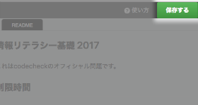

# Hello World チュートリアル

codecheckへようこそ！  
ここではcodecheckの試験の受験方法を簡単に紹介いたします。  
まずは緑色のボタンを押し、チャレンジを開始してください。

## 1. codecheckで「Hello world」を試してみよう

### 1-1.  制限時間・締切を確認しよう
画面上部に、制限時間・あるいは解答締切が表示されるようになります。  
制限時間や締切をオーバーすると解答の提出ができませんので、ご注意ください。  


### 1-2. Webエディタ or GitHubでの解答の選択
codecheckでは専用のWebエディタで問題を回答するか、  
チャレンジによってはGitHubアカウントを活用して、自身のローカル環境にて問題の回答をすることが出来ます。  
**まずは、画面右側にある"Webエディタで開く"ボタンをクリックして、Webエディタを立ち上げてみましょう。**  


---

## 2. Webエディタで解答してみよう

### 2-1. ファイルを開く
Webエディタをひらいたら、[こちらのリンク](test/basic.js)をクリックしてください。  

リンクで指定されたファイルが、エディタ上で開かれていることを確認してください。  
リンクをクリックして指定されたファイルを表示することが可能です。  
同じく、Webエディタ上の画面左側のプロジェクトツリーからもファイルをクリックして開くことが可能です。

### 2-2. 要求内容の確認
以下のようにチャレンジの要求している内容が問題文の中で紹介されます。  
要求内容を熟読した上で実装をすることをお勧めします:

```
ザ・ミッション:
ある任意の文字列 [string] が入力されたとき、
"Hello [string]!"
と返すような関数を実装してください。

例えば、"World"が入力された時、"Hello World!"と返し、  
"codecheck"の場合は、"Hello codecheck!"と返します。
```

### 2-3. ファイルの編集
Webエディタ上のファイルを編集してみましょう。  
[answer.md](answer.md)を開き、`## Q1. 得意なプログラミング言語`  と表記してある下の行に自分の得意とするプログラミング言語を記入してください。


### 2-4. ファイルの保存
編集が完了したら、画面右上の"保存する"ボタンをクリックしましょう。  


保存が完了したら"編集を続ける"ボタンを選択しましょう。

### 2-5. ファイルの実行
正しく実装できているかどうかを確かめるために、テスト（正しく動いているかどうかを確かめるコード）を実行することが出来ます。  
エディタ中部の”テスト実行”ボタンをクリックしてみましょう。  
クリックすると、テストコードが実行されます。少々時間がかかりますが、最後に

```
== Test outputs ==========
1..3
argv[0]: World
not ok 1 CLIアプリは 'World'が与えられた場合に'Hello World!'と出力できる。
argv[0]: 織田信長
not ok 2 CLIアプリは '織田信長'が与えられた場合に'Hello 織田信長!'と出力できる。
argv[0]: codecheck
not ok 3 CLIアプリは 'codecheck'が与えられた場合に'Hello codecheck!'と出力できる。

# tests 3
# pass 0
# fail 3
== Test result ==========
Exit code: 3
Number of test cases: 3
Passed: 0
Failed: 3
```

と表示されます。
上記の出力の場合、テストケース（期待される入力と出力値）3つに対して、どれも正しく回答ができていない事になります。

### 2-6. 正しい解答をしてみよう
現段階では、完璧な回答ではありません。  
先ほど表示されていた[basic.js](test/basic.js)  
の2つのテストを通過するコードを書いてみましょう。

入力値を引数に取り、期待されている結果を標準出力に出力するCLIアプリケーションとして解答を実装してください。  
CLIの実装方法については[指定言語].md に記載されており、Webエディタの右上のタブから選択できます。  


もし、正しく解答ができた場合は、

```
== Test outputs ==========
1..3
Hello World!
ok 1 CLIアプリは 'World'が与えられた場合に'Hello World!'と出力できる。
Hello 織田信長!
ok 2 CLIアプリは '織田信長'が与えられた場合に'Hello 織田信長!'と出力できる。
Hello codecheck!
ok 3 CLIアプリは 'codecheck'が与えられた場合に'Hello codecheck!'と出力できる。

# tests 3
# pass 3
# fail 0
== Test result ==========
Exit code: 1
Number of test cases: 3
Passed: 3
Failed: 0
```
と表示がされます。

### 2-7. 保存の習慣化
**こまめにSaveボタンをクリック** してください。  
Saveボタンをクリックをしないと解答した内容が保存されず、  
無回答として提出されてしまう可能性があります。  


---

## 3. GitHubを使って解答してみよう（※GitHubユーザ向け）
### 3-1. GitHubアカウントの連携
まず、GitHubを活用して回答をする場合、codecheck内でGitHubアカウントの連携が必要です。  
[こちらのページ](https://app.code-check.io/settings/social)から、GitHubアカウントの連携をおこないます。


こちらの「接続」をクリックし、GitHubのアカウントの連携をしてください。  
アカウントの連携が完了しましたら、再度こちらの画面をリロードしてください。  
正しく接続が完了すると、"GitHubで解く"ボタンが選択できるようになります。

### 3-2. チャレンジをフォークしてみましょう
画面右側の"GitHubで解く"をクリックしてみましょう。  


上記のダイアログが立ち上がったら、リポジトリ名を入力して、作成を選択してみましょう。  
すると、GitHubの生成されたリポジトリURLが表示されます。


表示されたURLをクリックすると、生成されたGitHubのページにジャンプすることが出来ます。

### 3-3. ファイルの編集
GitHubを使って回答の編集をしてみましょう。  
ローカルにクローンをすれば、自分自身の好きな環境やエディタで自由に回答を編集することも可能です。  
今回は、`answer.md`を編集してみましょう。  

### 3-4. 回答のPush
回答を編集したら、編集内容をcodecheck上に保存します。  
リモートのmasterにプッシュ(`git push origin master`)するだけで、回答内容をcodecheck上に保存する事ができます。  
無事にリモートのmasterにプッシュが完了すると、codecheck側にもmasterの編集内容が保存されます。  
masterにpushした後、チャレンジの詳細画面に戻ってください。  
「保存」の下に表示されている時間が、pushをした時間に切り替わっていれば、正しく保存が完了しています。  


### 3-5. 保存されているかの確認
保存が完了したら、正しく保存ができているのか、改めてWebエディタで確かめてみましょう。  
Webエディタ画面を再度開いてみてください。(既に開いている場合はリロード)  
編集したファイルが正しく保存され、更新されていれば完了です。  
また、画面右上のSAVEボタンが押せなくなっており"READONLY Solving in GitHub"と表示されます。  
**一度GitHubで受験をし、ローカルから保存をすると、Webエディタからは編集・保存ができなくなるので、ご注意下さい**

また、Webエディタ上で`answer.md`を開いてみましょう。
あなたがローカルで編集した内容が反映されたら成功です。  

最後に、テスト実行ボタンを押してみましょう。
```
codecheck: Finish 'npm install with code 0
1..2
ok 1 helloWorld Hello World!
# tests 2
# pass 2
# fail 0
codecheck: Finish with code 0
codecheck: tests  : 2
codecheck: success: 2
codecheck: failure: 0
```

が表示されたら正しく解答ができていることになります。  
このように、GitHub上で受験・保存をした後も、codecheck上でテストを実行し、結果を確かめることが可能です。

---

## 4. チャレンジを提出しよう
### 4-1. answer.mdの表示とコメント
codecheckでは、あなたが工夫して解答した点を[answer.md](answer.md)にまとめることが出来ます。
こちらのファイルを開いて、指定されている質問に回答してみましょう。  
こちらのファイル内容は企業側が閲覧します。自由に自身のエンジニアスキルを表現してみてください。  

### 4-2. チャレンジの提出
全ての解答内容の保存が確認できたら、解答を提出しましょう。
チャレンジの詳細画面に戻り、画面右上の「提出（submit）」ボタンを押して「OK」をクリックすると、提出が完了します。  
一度提出をすると、変更や再受験は出来ませんので、ご注意ください。

---

## 5. その他
### 環境変数の利用について

APIキーや認証トークンなど、**秘匿する必要のある変数は、github上に直接アップロードしないでください。**  
キーを実装物にハードコードしたままgithubにpushしてしまうと、  
個人用のAPIキーなどの情報が公開されてしまい、悪用される可能性が発生します。

代わりに、codecheckの環境変数機能をご利用ください。  
秘匿したい情報を他者に公開せずにcodecheck内で登録・利用し、  
正しく動作するコードをcodecheck上に提出することが可能になります。

1. 試験のチャレンジ一覧ページ、チャレンジ横にドロップメニューのボタンが表示されます。  
  

2. そのボタンをクリックすると、「環境変数の設定」という項目が表示されます。  
 

3. 「環境変数の設定」をクリックし、任意の命名でAPIキー等の環境変数を設定ください。  
 
